# Seeed Wio Tracker L1 - MeshCore "Solo" companion firmware

This branch extends the official MeshCore companion radio firmware for the **Seeed Wio Tracker L1**. Provides support for both the original OLED and the e-ink variant, with additional features and UI enhancements.

Join the discussion on the official MeshCore Discord: https://discord.gg/sdhYArU2jr

Solo firmware thread: https://discord.com/channels/1495203904898728149/1505294337884553447


**Enclosures**

- [E-ink case](https://www.printables.com/model/1420534-seeed-wio-tracker-l1-e-ink-enclosure)
- [Oled case](https://www.printables.com/model/1380791-meshpack-seeed-l1-oled)

---

## Feature highlights

- Extended language support with native Unicode rendering and input [Lemon font](https://github.com/cmvnd/fonts) alongside the original ASCII mode (Default font with transliteration)

- Enabled sensor screens with support for all onboard sensors (temperature, humidity, pressure, luminosity, CO₂) and GPS data

- [Messages Screen](./docs/solo_features/message_screen/message_screen.md) — view and send messages, open message details, reply with quick messages or custom text, per-channel notification and melody overrides

- [Favourites Dial](./docs/solo_features/favourites_dial/favourites_dial.md) — pin up to six contacts for quick access from the home screen

- [Settings Screen](./docs/solo_features/settings_screen/settings_screen.md) — configure display, sound, home page order, radio and system settings

- [Clock Screen](./docs/solo_features/clock_screen/clock_screen.md) — view time and date plus up to three configurable data fields

- [Screen Lock](./docs/solo_features/screen_lock/screen_lock.md) — lock the device to prevent accidental keypresses, with a lock screen showing time and sensor data

- [Tools Screen](./docs/solo_features/tools_screen/tools_screen.md) — GPS trail recording and export, nearby nodes, ringtone editor, auto-reply bot, auto-advert

---

## Menu Structure

```mermaid
flowchart TD
    Home[("Home Screen")]
    
    Home --> Clock[Clock]
    Home --> Favourites[Favourites]
    Home --> Recent[Recent]
    Home --> Radio[Radio]
    Home --> Bluetooth[Bluetooth]
    Home --> Advert[Advert]
    Home --> GPS[GPS]
    Home --> Sensors[Sensors]
    Home --> Settings[Settings]
    Home --> Tools[Tools]
    Home --> Messages[Messages]
    Home --> Shutdown[Shutdown]
    
    Tools --> RingtoneEditor[Ringtone Editor]
    Tools --> Bot[Auto-Reply Bot]
    Tools --> Nearby[Nearby Nodes]
    Tools --> AutoAdvert[Auto-Advert]
    Tools --> Trail[GPS Trail]
    
    Settings --> Display[Display]
    Settings --> Sound[Sound]
    Settings --> HomePages[Home Pages]
    Settings --> Radio[Radio]
    Settings --> System[System]
    Settings --> Contacts[Contacts]
    Settings --> MsgSlots[Message Slots]
    
    Messages --> Direct[Direct]
    Messages --> Channels[Channels]
    Messages --> Rooms[Room Servers]
    
    Clock --> DashConfig[Dashboard Config]
```



### E-ink Display

The e-ink variant targets the Wio Tracker L1 fitted with a 2.13″ GxEPD2 panel (250 × 122 px). All screens have been adapted for the e-ink panel:

- **Adaptive layout** — every screen reflows correctly in both landscape (250 × 122) and portrait (122 × 250) orientations
- **Display rotation** — configurable in Settings › Display; applied immediately and persisted across reboots
- **Joystick rotation** — independent of display rotation; useful for custom enclosures
- **Full refresh interval** — configurable in Settings › Display; reduces ghosting on long sessions
- **Clock seconds suppressed by default** — seconds are hidden to reduce per-second panel refreshes and extend display lifetime; re-enable in Settings › Display

## Firmware Variants

Two firmware builds are published with each release:

| Variant   | Display                   | File                      |
| --------- | ------------------------- | ------------------------- |
| **OLED**  | SSD1306 / SH1106 128 × 64 | `solo-<version>-oled.uf2` |
| **E-ink** | GxEPD2 250 × 122          | `solo-<version>-eink.uf2` |

Both variants are built from a single codebase and share the same feature set. The firmware supports both BLE and USB serial in a single binary — there are no separate BLE/USB builds.

> [!IMPORTANT]
> BLE connection has priority over USB serial. When a BLE connection is active, the USB protocol is suspended. When connecting to the companion app via USB, ensure to disconnect from BLE first or disable BLE directly from the device to avoid confusion.

### Flashing

1. Download the appropriate `.uf2` file for your display variant from the [releases page](https://github.com/MarekZegare4/MeshCore-Solo/releases)
2. Press reset twice quickly to enter bootloader mode (solid amber LED) - the device should appear as a mass storage drive on your computer
3. Copy the `.uf2` file to the drive to flash the firmware

Updating to newer firmware versions usually does not require erasing flash unless the release notes explicitly state otherwise. To retain your settings and data, avoid performing a factory reset after flashing unless you need to start fresh or encounter problems.

> [!WARNING]
> When migrating from official/custom firmware, backup your data and **perform factory reset** to prevent conflicts with existing settings and data:
>
> 1.  Open device settings in the companion app and download data backup
> 2.  Go to [MeshCore Flasher](https://meshcore.io/flasher) website
> 3.  Select "Wio Tracker L1 Pro"
> 4.  Choose any of the firmware variant
> 5.  Perform "Erase flash"

---

## Documentation

### This fork

| Document                                                                   | Description                                                           |
| -------------------------------------------------------------------------- | --------------------------------------------------------------------- |
| [Messages Screen](./docs/solo_features/message_screen/message_screen.md)   | Sending messages, context menus, reply, Notif/Melody overrides        |
| [Favourites Dial](./docs/solo_features/favourites_dial/favourites_dial.md) | Pinned contacts grid, unread badges, pin/unpin                        |
| [Clock Screen](./docs/solo_features/clock_screen/clock_screen.md)          | Clock page, date, configurable data fields                            |
| [Settings Screen](./docs/solo_features/settings_screen/settings_screen.md) | All settings sections with values and interactions                    |
| [Screen Lock](./docs/solo_features/screen_lock/screen_lock.md)             | Lock/unlock sequence, lock screen, auto-lock                          |
| [Tools Screen](./docs/solo_features/tools_screen/tools_screen.md)          | GPS trail, nearby nodes, ringtone editor, auto-reply bot, auto-advert |

### Upstream MeshCore

| Document                                           | Description                                      |
| -------------------------------------------------- | ------------------------------------------------ |
| [FAQ](./docs/faq.md)                               | Frequently asked questions                       |
| [CLI Commands](./docs/cli_commands.md)             | Commands for repeaters, room servers and sensors |
| [Terminal Chat CLI](./docs/terminal_chat_cli.md)   | Commands for the terminal chat client            |
| [Companion Protocol](./docs/companion_protocol.md) | Serial/BLE frame protocol between device and app |
| [Packet Format](./docs/packet_format.md)           | LoRa packet structure                            |
| [QR Codes](./docs/qr_codes.md)                     | Channel and contact QR code formats              |

---

## Screenshot Tool

The firmware can capture the current display contents and send them over USB serial as a PNG — useful for debugging and documentation. Works with both OLED and e-ink variants.

> [!NOTE]
> Requires firmware built with `-D ENABLE_SCREENSHOT`. Use the `_dev` environment or add the flag manually.

**1. Build and flash with screenshot support**

```sh
# OLED
PLATFORMIO_BUILD_FLAGS="-D ENABLE_SCREENSHOT" pio run -e WioTrackerL1_companion_dual -t upload

# E-ink
pio run -e WioTrackerL1Eink_companion_dual_dev -t upload
```

**2. Disconnect from the companion app** — USB serial is not available while BLE/app is connected

**3. Run the tool** — [uv](https://docs.astral.sh/uv/) is recommended for managing Python dependencies:

```sh
uv run tools/screenshot.py
```

Options:

- `--port PORT` — serial port (default: auto-detect)
- `--scale SCALE` — upscale factor for output image (default: 1)

**4.** Press **S** in the interactive menu to capture. Screenshots are saved to `tools/pngs/` with a timestamp filename.

---

## GPX Trail Export

Capture the GPS trail as a GPX 1.1 file by streaming it over USB serial.

```sh
uv run tools/trail_export.py
```

Run the script, then on the device: **Tools › Trail › Hold Enter ›**

- **Export (live)** — current RAM trail
- **Export (saved)** — `/trail` file from flash

The script auto-detects the port, waits for the `<?xml` start, captures bytes until `</gpx>`, and writes the file to `tools/gpx/trail_<timestamp>.gpx`.

> If the companion app is connected over BLE the export is safe (USB receive is ignored). If the app is on USB, disconnect it first — the raw GPX stream will otherwise disrupt the app's frame protocol.

---

## Development

This fork tracks the upstream [MeshCore](https://github.com/ripplebiz/MeshCore) repository. To prevent upstream changes from overwriting this README during merges, `README.md` is protected via `.gitattributes`. After cloning, run once:

```sh
git config merge.ours.driver true
```

### Contributing

Contributions are welcome. Fork the repository, make your changes, and open a pull request. Please follow the existing code style and keep changes focused.
